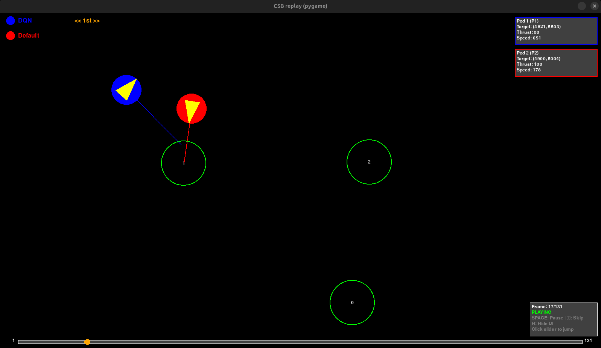
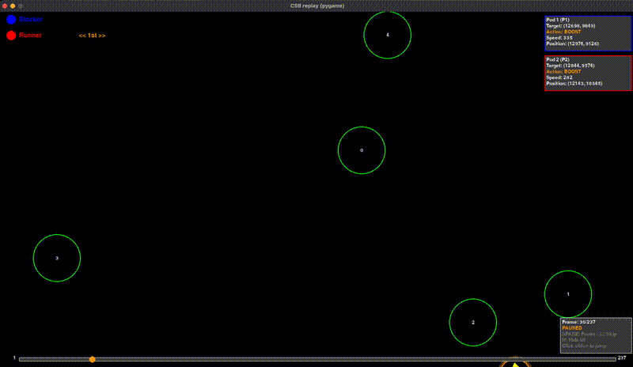

# Mad Pod Racing Neural Networks Project

A simple game simulation framework for [Mad Pod Racing](https://www.codingame.com/multiplayer/bot-programming/mad-pod-racing) featuring animated battles between customizable AI players. Supports saving and replaying games using `pickle`, and visualizing gameplay with `pygame`.

## Project Overview

This project simulates a turn-based game Mad Pod Racing between two "bots." Players can be:

- [Setup](#setup)
  - [Clone the repository](#1-clone-and-install)
  - [Virtual Enviroment](#2-activate-the-virtual-environment)
  - [Usage](#3-usage)
    - [Training](#training)
    - [Compression](#compression)
    - [Animation](#animation)
- [Animation GUI Features](#animation-gui-features)
  - [Visual Elements](#visual-elements)
    - [Pods](#pods)
    - [Track Elements](#track-elements)
    - [UI Panels](#ui-panels)
    - [Interactive Controls](#interactive-controls)
  - [Interactive Controls](#interactive-controls)
    - [Playback Control](#playback-control)
    - [Display Options](#display-options)
    - [Visual Feedback](#visual-feedback)
  - [Action Information Display](#action-information-display)
  - [Special Effects](#special-effects)
    - [Shield Animation](#shield-animation)
    - [Boost Animation](#boost-animation)

## Setup
This project uses [Poetry](https://python-poetry.org/) for dependency management.

### 1. Clone and Install
```bash
git clone git@github.com:gkodrzycki/mad_pod_racing.git
cd mad_pod_racing
poetry install
```

### 2. Activate the Virtual Environment
```bash
poetry shell
```

### 3. Usage
#### Training
##### Train MLP using data from the forum (data.txt)
```bash
python train_QAgent_fromdata.py
```
\
Following trainings scripts can be parametrized by changing corresponding configs.

##### Train runner using environment without obstacles/blocker
```bash
python train_QAgent_env_solo.py
```

##### Train runner/blocker against other (only one is training)
```bash
python train_QAgent_env_with_blocker.py
```

To change training mode modify `agent_to_train_idx` variable accordingly.
#### Compression
Depending on used training we have `codingame_DDQN_template.py` and `codingame_duelingDQN_template.py`.

To compress your model into working codingame bot run following command depending on your training mode.
```bash
python compress_DDQN.py
or
python compress_duelingDQN.py
```

Remember to provide needed parameter ins **main** section like paths to models and input/output dimensions.

#### Animation
##### Run the default match with animation
```bash
python main.py
```

##### Play without animation and save the game
```bash
python main.py -noAnimation -saveGame game1.pkl
```

##### Replay a saved game
```bash
python main.py -playFile game1.pkl
```

## Animation GUI Features

The pygame-based animation provides rich visual feedback and interactive controls for analyzing gameplay.





### Visual Elements

#### Pods
- **Blue pods**: Player 1's racing pods
- **Red pods**: Player 2's racing pods
- **Yellow triangle**: Pod direction indicator
- **Target line**: Line showing pod's target destination
- **Shield animation**: Pulsing cyan circles when pod uses SHIELD
- **Boost animation**: Pulsing orange rings when pod uses BOOST

#### Track Elements
- **Green circles**: Checkpoints with numbered labels
- **Checkpoint radius**: Shows the activation area for each checkpoint

#### UI Panels
- **Player legend** (top-left): Shows player names with winner indication
- **Action info rectangles** (right side): Real-time pod action data
  - Pod identification (P1/P2)
  - Target coordinates
  - Current action (Thrust value/BOOST/SHIELD)
  - Pod speed
- **Frame counter** (bottom-right): Current frame, total frames, and playback status
- **Slider** (bottom): Slider for easier jumping between game stages

### Interactive Controls

#### Playback Control
- **SPACE**: Pause/Resume animation
- **LEFT ARROW (←)**: Skip backward by 1 frame
- **RIGHT ARROW (→)**: Skip forward by 1 frame

#### Display Options
- **H**: Toggle UI visibility (hide/show all information panels)
  - When hidden: Shows only pods, checkpoints, and basic controls
  - When visible: Shows all action info, legends, and detailed statistics

#### Visual Feedback
- **PLAYING**: Green status indicator during normal playback
- **PAUSED**: Orange status indicator when paused
- **Frame progress**: Real-time frame counter showing current position

### Action Information Display
Each pod's action rectangle shows:
- **Pod identification**: "Pod 1 (P1)" or "Pod 2 (P2)" etc.
- **Target coordinates**: Destination point the pod is aiming for
- **Action type**:
  - `Thrust: [0-200]` - Normal thrust value (white text)
  - `Action: BOOST` - Boost activated (orange text)
  - `Action: SHIELD` - Shield activated (cyan text)
- **Speed**: Current velocity magnitude

### Special Effects

#### Shield Animation
- Pulsing cyan outer ring
- Enhanced pod border
- Visual indication of invulnerability state

#### Boost Animation
- Multiple expanding orange rings
- Flame-like effect
- Intensified visual feedback for boost activation

The animation automatically ends when the game concludes, but you can pause at any time to examine the final state.
