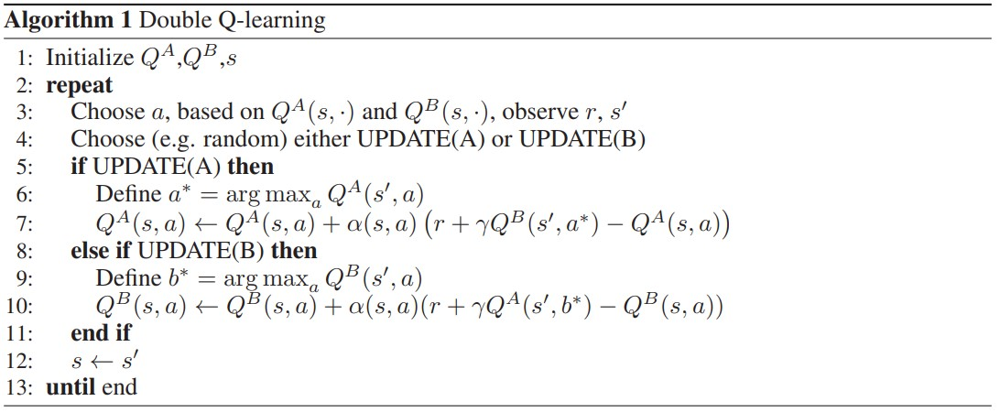
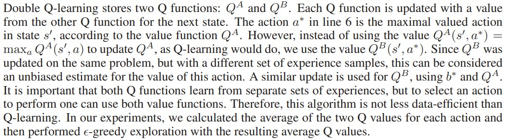
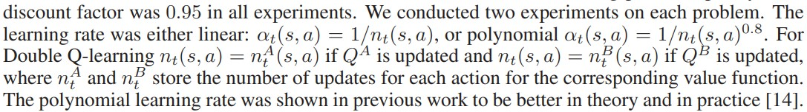

## Główne usprawnienia

#### Double Q-learning

Nakład pracy potrzebny do wprowadzenia: *mały*  
Na podstawie: https://papers.nips.cc/paper_files/paper/2010/file/091d584fced301b442654dd8c23b3fc9-Paper.pdf

W Q-learnigu jest tendencja do przeszacowania wartości danej akcji w danym stanie przez tego maxa we wzorze:

$(1)$ $Q_{t+1}(s_t, a_t) \leftarrow 
(1 - \alpha) \cdot Q(a_t, a_t) + 
\alpha \cdot \left( r_{t+1} + \gamma \cdot \max_a Q(s_{t+1}, a) \right)$

To co chcemy zrobić tutaj to szacować/przybliżyć $\max_a Q(S_{t+1}, a)$ -> będzie się to działo w trakcie uczenia.

--------------------------
Rozpoczynamy od tego, że klasyczny wzór $(1)$ zamieniamy na:  
$Q_{t+1}(s_t, a_t) = Q_t(s_t, a_t) + \alpha_t(s_t, a_t) \left( r_t + \gamma \max_a Q_t(s_{t+1}, a) - Q_t(s_t, a_t) \right)$

Uczenie wygląda w ten sposób:

#### Przeklejony fragment (drugi paragraf punktu 3. z paperka) opsiujący co się dzieje na powyższym obrazku:

#### Skąd bierzemy $\alpha_t(s_t, a_t)$:
*skopiowane z paragrafu 4.*

#### Dueling Network

Nakład pracy potrzebny do wprowadzenia: *mały*  
Na podstawie: https://arxiv.org/pdf/1511.06581v3

Ogólnie w pracy chodzi nam o to, że jak mamy w ogólności to równanie:

$(1)$ $$ Q(s, a; \theta, \alpha, \beta) = V(s; \theta, \beta) + A(s, a; \theta, \alpha) $$

$\alpha$, $\beta$ - parametry tych równoległych streamów w sieci  
$\theta$ - parametry warstw konwolcyjnych (w paperku mamy sieć konwolucujną - u nas po prostu $mlp$)

to chcielibyśmy wziąć pod uwagę, że czasem jest tak, że akcja nie ma znaczenia, i liczy się tylko dobroć tego stanu w którym jesteśmy.

W (1) jest też taki problem, że np. jak $V$ zmniejszymy o jakąś stałą, a $A$ zwiększymy o tą samą stałą, to suma sumarum dostaliśmy to samo $Q$, czyli zgubiliśmy rozróżnienie "dobroć stanu vs dobroć akcji", i aby zachować to rozróżnienie wprowadzamy "normalizację" - podali w paperku dwa sposoby:

$(2)$  $$Q(s, a; \theta, \alpha, \beta) = V(s; \theta, \beta) + \left( A(s, a; \theta, \alpha) - \max_{a'} A(s, a'; \theta, \alpha) \right)$$

$(3)$ $$Q(s, a; \theta, \alpha, \beta) = V(s; \theta, \beta) + \left( A(s, a; \theta, \alpha) - \frac{1}{|\mathcal{A}|} \sum_{a'} A(s, a'; \theta, \alpha) \right)$$

Wtedy zmuszamy $A$ do bycia względną miarą przewagi – np. największa przewaga to 0 ( w przypadku $(1)$), inne akcje mają wartości ujemne, a w przypadku $(2)$ wiemy o ile lepsza jest dana akcja od średniej wartości akcji.

W paperku też wyczytałem, że przewaga tej architektury jest bardziej znacząca przy większej ilości akcji.

Zmiana dotyczy samej sieci, więc można używać wszystkich usprwanień samej procedury trenowania.